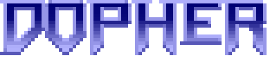
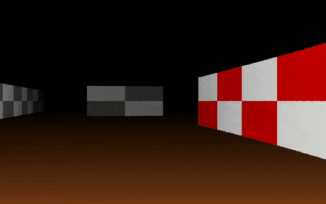

# Dopher - A Doom-style Engine in Go

<p align="center">
  
</p>
<p align="center">
  
</p>

A sophisticated raycasting engine inspired by the original Doom, implemented in Go using SDL2.

## Description

Dopher is an advanced 3D rendering engine that utilizes raycasting techniques similar to those used in classic games like Wolfenstein 3D and Doom. It creates an immersive pseudo-3D visualization from a 2D map, featuring textured walls, sprite-based NPCs, dynamic lighting effects, and realistic floor rendering with distance-based shading.

The engine employs Digital Differential Analysis (DDA) for precise wall detection and implements a z-buffer system for proper depth sorting of walls and sprites. This allows for realistic occlusion of NPCs behind walls and accurate perspective rendering. The engine features smooth player movement with momentum-based physics, dynamic field of view adjustments during sprinting, and interactive NPCs with a typewriter-style dialog system.

At its core, Dopher combines efficient raycasting algorithms with modern rendering techniques to create a seamless retro-inspired gaming experience. The physics system provides realistic movement with momentum, crouching capabilities, and collision detection, while the sprite system handles transparent NPCs that can be occluded by walls. The dynamic FOV system smoothly transitions during player movement, enhancing the sense of speed and immersion.

## Features

- First-person perspective rendering with raycasting
- Textured walls with proper perspective and distance shading
- Realistic floor rendering with gradient darkness based on distance
- Sprite-based NPCs with transparency and occlusion
- Interactive NPCs with typewriter-style dialog system
- Enemy AI with detection radius, chase behavior and pathfinding
- Collision detection with walls and NPCs using circular hitboxes
- Distance-based shading and fog effects
- Dynamic FOV during sprinting with smooth LERP transitions
- Physics-based movement system with momentum and friction
- Crouching mechanics that adjust player height and speed
- Dash ability with cooldown for quick movement bursts
- Advanced texture mapping with proper coordinate calculation
- Configurable display settings and game parameters
- Simple 2D map system with extensible layout
- Z-buffer implementation for proper depth sorting
- Head bobbing effect during movement
- Multiple wall textures support
- Fullscreen toggle support (F key)
- Optimized rendering with goroutines
- Transparent sprite rendering with proper depth testing
- Minimap toggle (TAB key)
- Fullscreen megamap toggle (M key)
- Real-time player position and direction indicators
- Multi-level visualization with different wall types
- Semi-transparent map overlays
- Pause menu system with game control options
- Font management system with TTF support
- Centralized event handling system
- Game state management with pause/resume functionality

## Controls

- W/A/S/D: Move around
- Left/Right Arrow: Rotate view
- Left Shift (hold): Sprint while moving
- Left Ctrl (hold): Crouch to move slower and reduce height
- Space: Dash in movement direction (with cooldown)
- E: Interact with NPCs
- ESC: Toggle pause menu
- Q: Quit game
- TAB: Toggle minimap
- M: Toggle fullscreen map
- F: Toggle fullscreen mode

## Pause Menu

Press ESC during gameplay to access the pause menu. Use the Up/Down arrow keys to navigate options and Enter to select:

- Resume: Return to gameplay
- Quit: Exit the game

## Prerequisites

- Go 1.24 or later
- SDL2 development libraries
- SDL2 TTF development libraries (for dialog system)

### Installing Dependencies

On Ubuntu/Debian:

```bash
sudo apt-get install libsdl2-dev libsdl2-ttf-dev
```

### Installation

A. Clone the repository:

```bash
git clone https://github.com/YourUsername/dopher.git
cd dopher
```

B. Install dependencies:

```bash
go mod tidy
```

C. Run the game:

```bash
go run main.go
```

### Project Structure

```struct
dopher/
├── assets
│   ├── font
│   │   └── dogicapixel.ttf
│   ├── preview
│   │   ├── logo.png
│   │   └── preview.gif
│   └── textures
│       ├── beef.bmp
│       ├── npc.bmp
│       ├── wall2.bmp
│       └── wall.bmp
├── internal
│   ├── char
│   │   ├── npc
│   │   │   ├── checker.go
│   │   │   ├── dialog.go
│   │   │   ├── enemy.go
│   │   │   └── npc.go
│   │   └── player
│   │       ├── checker.go
│   │       └── movement.go
│   ├── core
│   │   ├── events.go
│   │   ├── initializer.go
│   │   └── run.go
│   ├── graphics
│   │   ├── casting
│   │   │   ├── cast.go
│   │   │   ├── font.go
│   │   │   └── textures.go
│   │   └── renders
│   │       ├── floor.go
│   │       ├── game.go
│   │       ├── megamap.go
│   │       ├── minimap.go
│   │       ├── npc.go
│   │       ├── pause.go
│   │       ├── roof.go
│   │       ├── scene.go
│   │       └── slices.go
│   └── model
│       ├── constant.go
│       ├── maps.go
│       └── models.go
├── go.mod
├── go.sum
├── main.go
└── README.md
```

### Technical Details

- Raycasting engine with DDA algorithm
- Z-buffer implementation for proper depth sorting
- Texture mapping with perspective correction
- Sprite system with transparency and occlusion
- Physics-based movement system with momentum
- Dialog system with typewriter effect
- Enemy AI with detection radius, chase behavior and obstacle avoidance
- Dynamic FOV system with smooth LERP transitions
- Multi-threaded rendering pipeline
- Distance-based floor rendering with gradient shading
- Collision detection using ray-circle intersection
- Head bobbing animation system synchronized with movement
- Advanced floor rendering with gradient darkness based on distance
- Smooth state transitions using LERP for height and FOV changes
- Dynamic map system with multiple visualization modes
- Real-time player position tracking
- Directional indicators with triangle rendering
- Multi-layered map rendering with transparency
- Global font management system with size-based caching
- Centralized game state management
- Pause menu with navigation controls
- Crouching with height adjustment and speed reduction
- Dash mechanics with cooldown and directional acceleration
- TTF font rendering and text display system
- Structured game initialization and resource cleanup

### Acknowledgements

1. Inspired by id Software's Doom
2. Built with go-sdl2
3. Font: Dogica Pixel by Roberto Mocci
